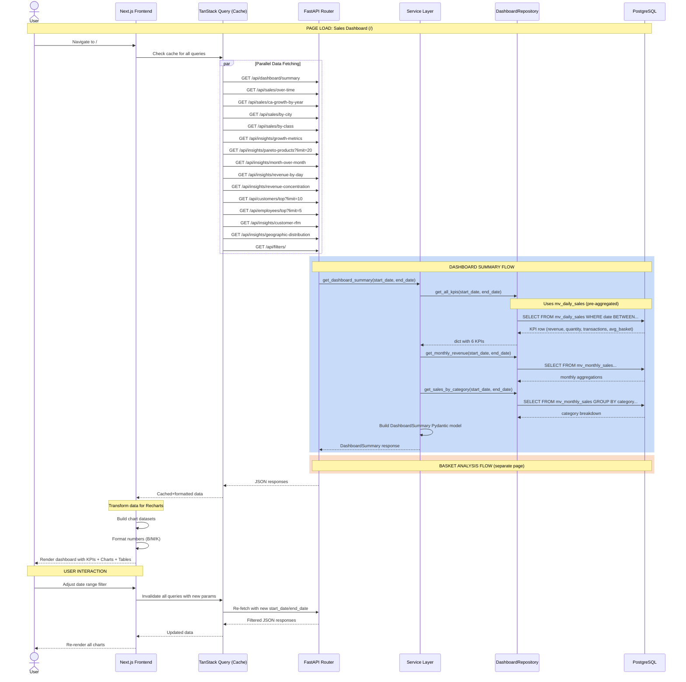
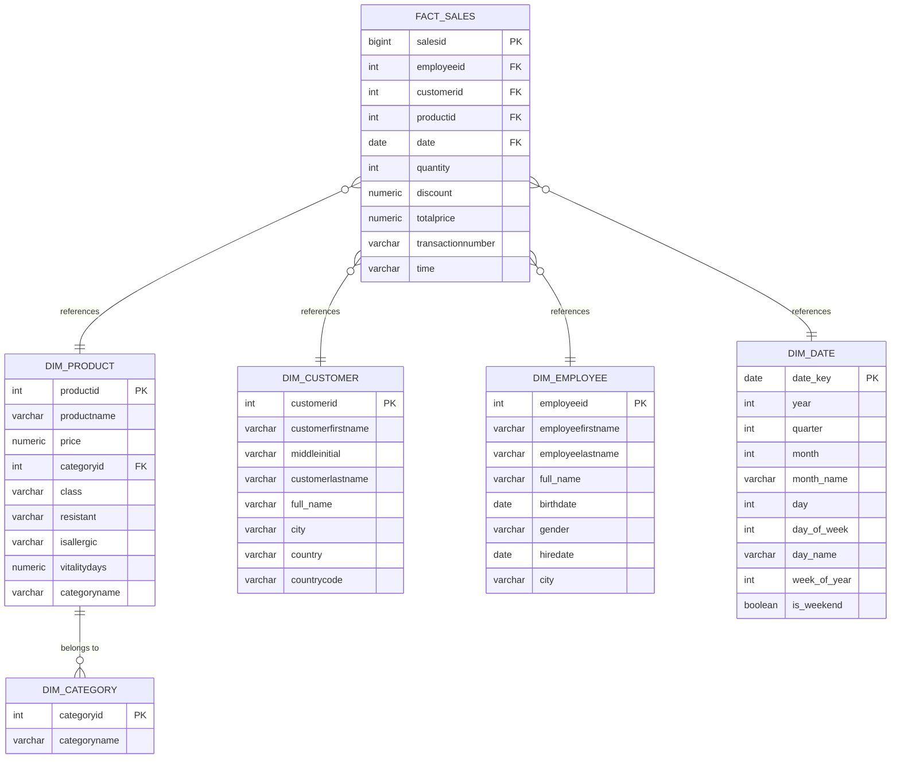

# 🏗️ Grocery Sales Dashboard — Architecture Diagrams

## 📑 Table of Contents

1. [Class Diagram](#1-class-diagram)
2. [Sequence Diagram](#2-sequence-diagram)
3. [ETL Pipeline Diagram](#3-etl-pipeline-diagram)
4. [Data Model (Star Schema)](#4-data-model-star-schema)

---

## 1. Class Diagram

The class diagram below illustrates the **layered architecture** of the backend application, showing the relationships between API routers, services, repositories, ORM models, and Pydantic schemas.

```mermaid
classDiagram
    %% ============================
    %% API LAYER (FastAPI Routers)
    %% ============================
    class DashboardRouter {
        +get_dashboard_summary(start_date, end_date) DashboardSummary
    }
    class SalesRouter {
        +get_sales_over_time(start_date, end_date, category) List~SalesOverTime~
        +get_sales_by_category(start_date, end_date, product) List~SalesByCategory~
        +get_monthly_sales(start_date, end_date) List~SalesByMonth~
        +get_ca_growth_by_year(start_date, end_date) List~CaGrowthByYear~
        +get_sales_by_city(start_date, end_date) List~SalesByCity~
        +get_sales_by_class(start_date, end_date) List~SalesByClass~
    }
    class ProductsRouter {
        +get_all_products(start_date, end_date) List~ProductList~
        +get_product_detail(id) ProductDetail
        +get_price_distribution(start_date, end_date) List~PriceDistribution~
        +get_price_volume_matrix(start_date, end_date) List~ProductPerformance~
    }
    class CustomersRouter {
        +get_segments() List~CustomerSegment~
        +get_top(limit) List~TopCustomer~
        +get_activity(start_date, end_date) List~CustomerActivity~
        +get_avg_basket_by_city(start_date, end_date) List~CustomerAvgBasketByCity~
        +get_growth_by_city(start_date, end_date) List~dict~
        +get_loyalty_stats(start_date, end_date) dict
    }
    class EmployeesRouter {
        +get_top(limit, start_date, end_date) List~TopEmployee~
        +get_performance_by_age(start_date, end_date) List~EmployeePerformanceByAge~
        +get_performance_by_seniority(start_date, end_date) List~EmployeePerformanceBySeniority~
        +get_gender_distribution() List~dict~
        +get_age_category_distribution() List~dict~
        +get_ca_by_age_tranche(start_date, end_date) List~dict~
    }
    class BasketRouter {
        +get_basket_analysis(min_support, min_lift, limit, start_date, end_date) BasketAnalysisResult
    }
    class FiltersRouter {
        +get_filter_options() FilterOptions
    }
    class InsightsRouter {
        +get_revenue_concentration() RevenueConcentration
        +get_revenue_by_day_of_week() List~DayOfWeekRevenue~
        +get_month_over_month() List~MomGrowth~
        +get_pareto_products(limit) List~dict~
        +get_growth_metrics(start_date, end_date) dict
        +get_customer_rfm() List~RFMSegment~
        +get_geographic_distribution() List~GeographicDistribution~
    }

    %% ============================
    %% SERVICE LAYER
    %% ============================
    class DashboardService {
        -repo DashboardRepository
        +get_dashboard_summary(start_date, end_date) DashboardSummary
    }
    class ProductService {
        -repo DashboardRepository
        +get_product_detail(id) ProductDetail
        +get_all_products(start_date, end_date) List~ProductList~
        +get_price_distribution(start_date, end_date) List~PriceDistribution~
        +get_price_volume_matrix(start_date, end_date) List~ProductPerformance~
    }
    class CustomerService {
        -repo DashboardRepository
        +get_customer_segments() List~CustomerSegment~
        +get_top_customers(limit) List~TopCustomer~
        +get_customer_activity(start_date, end_date) List~CustomerActivity~
    }
    class EmployeeService {
        -repo DashboardRepository
        +get_top_employees(limit, start_date, end_date) List~TopEmployee~
        +get_performance_by_age(start_date, end_date) List~EmployeePerformanceByAge~
        +get_performance_by_seniority(start_date, end_date) List~EmployeePerformanceBySeniority~
    }
    class BasketService {
        -repo DashboardRepository
        +get_basket_analysis(min_support, min_lift, limit, start_date, end_date) BasketAnalysisResult
        +includes hub_products, lift_distribution, top_matches, category_affinities
    }

    %% ============================
    %% REPOSITORY LAYER
    %% ============================
    class DashboardRepository {
        -db Session
        +get_all_kpis(start_date, end_date) dict
        +get_monthly_revenue(start_date, end_date, category) List~dict~
        +get_sales_by_category(start_date, end_date, product) List~dict~
        +get_price_distribution(start_date, end_date) List~dict~
        +get_price_volume_matrix(start_date, end_date) List~dict~
        +get_customer_segments() List~dict~
        +get_top_customers(limit) List~dict~
        +get_basket_rules(min_support, min_lift, limit) List~dict~  ← basket_analysis_results table
        +get_basket_total_baskets() int
        +get_basket_total_products() int
        +get_basket_hub_products(limit) List~dict~
        +get_basket_lift_distribution() List~dict~
        +get_basket_top_matches(limit) List~dict~
        +get_basket_category_affinities(limit) List~dict~
        +get_revenue_concentration() dict
        +get_revenue_by_day_of_week() List~dict~
        +get_month_over_month_growth() List~dict~
        +get_customer_rfm_segmentation() List~dict~
        +get_filter_options() dict
        +get_employee_performance_table(start_date, end_date) List~dict~
    }

    %% ============================
    %% ORM MODELS (SQLAlchemy)
    %% ============================
    class DimCategory {
        +categoryid: Integer PK
        +categoryname: String
    }
    class DimProduct {
        +productid: Integer PK
        +productname: String
        +price: Numeric
        +categoryid: Integer FK
        +class: String
        +resistant: String
        +isallergic: String
        +vitalitydays: Numeric
        +categoryname: String
    }
    class DimCustomer {
        +customerid: Integer PK
        +customerfirstname: String
        +middleinitial: String
        +customerlastname: String
        +full_name: String
        +city: String
        +country: String
        +countrycode: String
    }
    class DimEmployee {
        +employeeid: Integer PK
        +employeefirstname: String
        +employeelastname: String
        +full_name: String
        +birthdate: Date
        +gender: String
        +hiredate: Date
        +city: String
    }
    class DimDate {
        +date_key: Date PK
        +year: Integer
        +quarter: Integer
        +month: Integer
        +month_name: String
        +day: Integer
        +day_of_week: Integer
        +day_name: String
        +is_weekend: Boolean
    }
    class FactSales {
        +salesid: BigInteger PK
        +employeeid: Integer FK
        +customerid: Integer FK
        +productid: Integer FK
        +date: Date FK
        +quantity: Integer
        +discount: Numeric
        +totalprice: Numeric
        +transactionnumber: String
        +time: String
    }

    %% ============================
    %% SCHEMAS (Pydantic)
    %% ============================
    class DashboardSummary {
        +total_revenue: KPICard
        +total_quantity: KPICard
        +total_transactions: KPICard
        +avg_basket: KPICard
        +revenue_over_time: List~SalesOverTime~
        +sales_by_category: List~SalesByCategory~
        +monthly_sales: List~SalesByMonth~
        +top_products: List~TopProduct~
    }
    class BasketAnalysisResult {
        +total_transactions: int
        +total_products: int
        +rules: List~BasketRule~
        +top_rules_by_lift: List~BasketRule~
        +matrix_data: List~dict~
        +hub_products: List~HubProduct~
        +lift_distribution: List~LiftDistribution~
        +top_matches: List~ProductMatch~
        +category_affinities: List~CategoryAffinity~
    }
    class HubProduct {
        +product: str
        +connection_count: int
    }
    class LiftDistribution {
        +range_label: str
        +rule_count: int
        +percentage: Decimal
    }
    class ProductMatch {
        +hub_product: str
        +total_connections: int
        +matched_product: str
        +lift: Decimal
        +support: Decimal
        +nb_transactions: int
    }
    class CategoryAffinity {
        +category1: str
        +category2: str
        +pair_count: int
        +avg_lift: Decimal
    }
    class RFMSegment {
        +rfm_segment: str
        +customer_count: int
        +avg_spent: Decimal
        +total_revenue: Decimal
        +avg_frequency: Decimal
        +avg_categories: Decimal
    }

    %% ============================
    %% RELATIONSHIPS
    %% ============================
    %% API → Service
    DashboardRouter       --> DashboardService : uses
    SalesRouter           --> DashboardRepository : uses (direct)
    ProductsRouter        --> ProductService : uses
    CustomersRouter       --> DashboardRepository : uses (direct)
    EmployeesRouter       --> DashboardRepository : uses (direct)
    BasketRouter          --> BasketService : uses
    InsightsRouter        --> DashboardRepository : uses (direct)

    %% Service → Repository
    DashboardService      --> DashboardRepository : uses
    ProductService        --> DashboardRepository : uses
    CustomerService       --> DashboardRepository : uses
    EmployeeService       --> DashboardRepository : uses
    BasketService         --> DashboardRepository : uses

    %% Repository → ORM Models
    DashboardRepository   --> FactSales : queries
    DashboardRepository   --> DimProduct : queries
    DashboardRepository   --> DimCustomer : queries
    DashboardRepository   --> DimEmployee : queries
    DashboardRepository   --> DimCategory : queries
    DashboardRepository   --> DimDate : queries

    %% ORM Relationships
    DimProduct         --> DimCategory : categoryid →
    FactSales          --> DimProduct : productid →
    FactSales          --> DimCustomer : customerid →
    FactSales          --> DimEmployee : employeeid →
    FactSales          --> DimDate : date →

    %% Service → Schema (Pydantic)
    DashboardService      --> DashboardSummary : returns
    BasketService         --> BasketAnalysisResult : returns
```

---

## 2. Sequence Diagram

The sequence diagram below shows the **interaction flow** when a user loads the Sales Dashboard page. It illustrates how a single page load triggers multiple parallel API requests, each flowing through the layered architecture.

---

## 3. ETL Pipeline Diagram

The ETL (Extract, Transform, Load) pipeline processes raw CSV files into the PostgreSQL star schema. The pipeline is implemented in Python with pandas and SQLAlchemy.

```mermaid
flowchart TB
    subgraph EXTRACT["📥 EXTRACT — extractor.py"]
        direction TB
        CSV1[📄 categories.csv<br/>11 rows]
        CSV2[📄 products.csv<br/>~450 rows]
        CSV3[📄 customers.csv<br/>~100K rows]
        CSV4[📄 employees.csv<br/>~50 rows]
        CSV5[📄 cities.csv<br/>~1K rows]
        CSV6[📄 countries.csv<br/>~100 rows]
        CSV7[📄 sales.csv<br/>~6.7M rows]
        
        EX1[DataExtractor<br/>pandas.read_csv]
        CSV1 & CSV2 & CSV3 & CSV4 & CSV5 & CSV6 & CSV7 --> EX1
        EX1 --> VAL{File exists?<br/>Column count OK?}
        VAL -->|✅ Pass| RAW[Raw DataFrames]
        VAL -->|❌ Fail| ERR[Raise Error]
    end

    subgraph TRANSFORM["🔄 TRANSFORM — transformer.py"]
        direction TB
        RAW --> D1[1. Date Cleaning<br/>clean_sales_dates]
        D1 --> |Parse SalesDate<br/>Floor to seconds<br/>Drop null dates ~1%| D2[2. Column Standardization<br/>standardize_columns]
        D2 --> |snake_case rename<br/>Suffix disambiguation| D3[3. Dimension Enrichment]
        
        subgraph D3["3. Enrichment"]
            ENR1[enrich_products<br/>Join category name]
            ENR2[enrich_customers<br/>Join city/country]
            ENR3[enrich_employees<br/>Join city name]
        end
        
        D3 --> D4[4. Date Generation<br/>generate_dim_date]
        D4 --> |min_date → max_date<br/>Derive: year,month,quarter,<br/>day_of_week,is_weekend| D5[5. Fact Cleaning<br/>clean_fact_sales]
        D5 --> CLEANED[🧹 Cleaned DataFrames]
    end

    subgraph VALIDATE["✅ VALIDATE — validator.py"]
        CLEANED --> V1[DataValidator]
        V1 --> RULES{Rules Engine}
        RULES --> R1[PK Uniqueness 🔴 HIGH]
        RULES --> R2[NOT NULL Checks 🔴 HIGH]
        RULES --> R3[Price ≥ 0 🔴 HIGH]
        RULES --> R4[FK Referential Integrity 🔴 HIGH]
        RULES --> R5[Column Count Match 🟡 MEDIUM]
        R1 & R2 & R3 & R4 & R5 --> VR{All HIGH passed?}
        VR -->|✅ Yes| VALID[Validated DataFrames]
        VR -->|❌ No| VERR[Block Pipeline]
    end

    subgraph LOAD["📦 LOAD — loader.py"]
        direction TB
        VALID --> L1{Table size?}
        
        L1 -->|≤ 100K rows| L2[multi-row INSERT<br/>method='multi']
        L1 -->|> 100K rows| L3[PostgreSQL COPY<br/>10-50x faster]
        
        L2 --> L4[Load Dimensions<br/>FK Order]
        L3 --> L4

        subgraph L4["Dimension Load Order"]
            DIM1[1. dim_category<br/>INSERT 11 rows]
            DIM2[2. dim_product<br/>INSERT ~450 rows]
            DIM3[3. dim_customer<br/>INSERT ~100K rows]
            DIM4[4. dim_employee<br/>INSERT ~50 rows]
            DIM5[5. dim_date<br/>INSERT ~130 rows]
        end
        
        L4 --> L5[6. fact_sales<br/>COPY ~6.7M rows]
        L5 --> L6[7. Refresh Materialized Views]
        
        subgraph L6["Materialized Views"]
            MV1[mv_daily_sales]
            MV2[mv_monthly_sales]
            MV3[mv_customer_segmentation]
            MV4[mv_top_products]
            MV5[mv_employee_performance]
        end
    end

    subgraph SYNC["🔗 SYNC — sync.py"]
        L6 --> S1[DatabaseSynchronizer]
        S1 --> CHK1[Check table existence]
        S1 --> CHK2[Verify row counts ≥ threshold]
        S1 --> CHK3[Validate FK integrity]
        S1 --> CHK4[Detect schema drift]
        CHK1 & CHK2 & CHK3 & CHK4 --> DONE[(✅ PostgreSQL<br/>Star Schema)]
    end

    style EXTRACT fill:#e1f5fe,stroke:#0288d1
    style TRANSFORM fill:#fff3e0,stroke:#f57c00
    style VALIDATE fill:#e8f5e9,stroke:#388e3c
    style LOAD fill:#fce4ec,stroke:#c62828
    style SYNC fill:#f3e5f5,stroke:#7b1fa2
    style DONE fill:#c8e6c9,stroke:#2e7d32
```

### ETL Pipeline Summary

| Phase | Module | Key Functions | Data Volume |
|-------|--------|---------------|-------------|
| **Extract** | `extractor.py` | `DataExtractor.extract()` | 7 CSV files, ~6.7M rows |
| **Transform** | `transformer.py` | `clean_sales_dates()`, `standardize_columns()`, `enrich_products()`, `enrich_customers()`, `enrich_employees()`, `generate_dim_date()`, `clean_fact_sales()` | 6.7M → ~6.69M rows after null-date removal |
| **Validate** | `validator.py` | `DataValidator` with 10+ rules (PK, NOT NULL, FK, constraints) | Blocks pipeline on HIGH severity failures |
| **Load** | `loader.py` | `load_dataframe()` (INSERT for ≤100K, COPY for >100K), `refresh_materialized_views()` | ~6.7M fact rows loaded via COPY (10-50x faster) |
| **Sync** | `sync.py` | `DatabaseSynchronizer.verify_sync()` | Post-load integrity checks |

---

## 4. Data Model (Star Schema)

The star schema is composed of **5 dimension tables** and **1 fact table**, with **5 materialized views** for performance optimization.

### Materialized Views

| View | Purpose | Aggregation Level |
|------|---------|-------------------|
| `mv_daily_sales` | Base KPI queries, time series | Day + Product + Employee + Customer |
| `mv_monthly_sales` | Monthly trends, YoY comparison | Month + Category + Gender + Country |
| `mv_customer_segmentation` | Customer dashboard segments | Customer-level |
| `mv_top_products` | Product ranking | Product-level |
| `mv_employee_performance` | Employee dashboard metrics | Employee-level |

### Index Strategy

| Index Type | Examples | Purpose |
|------------|----------|---------|
| **Single-column** | `idx_fact_sales_date`, `idx_fact_sales_product` | Basic lookups and joins |
| **Composite** | `idx_fact_sales_date_product`, `idx_fact_sales_transaction_product` | Common query patterns and basket analysis |
| **Unique** | `idx_mv_daily_sales_unique` | Materialized view efficiency |
| **Functional** | `idx_dim_customer_fullname` | Text search on generated columns |

---

> **Project**: Grocery Sales BI Dashboard — Approach 2 (Code)  
> **Documentation updated**: June 2026
