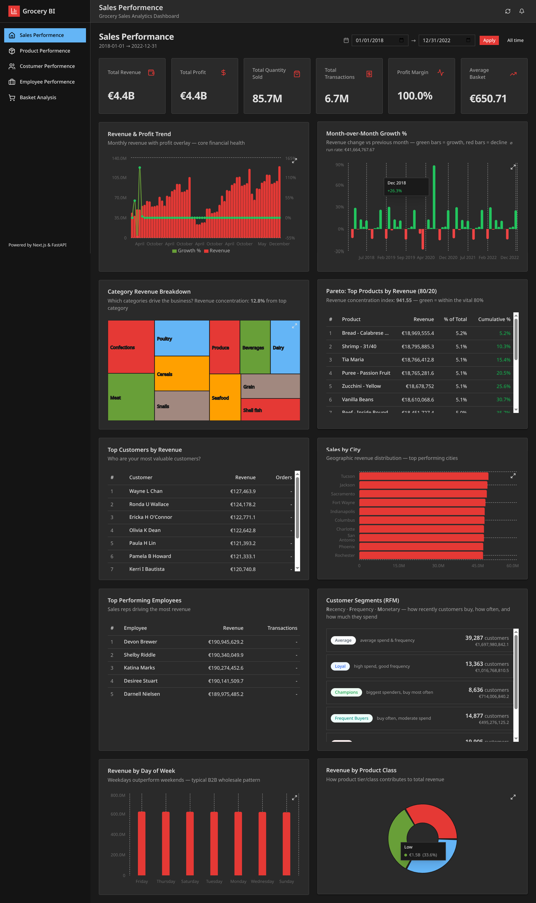
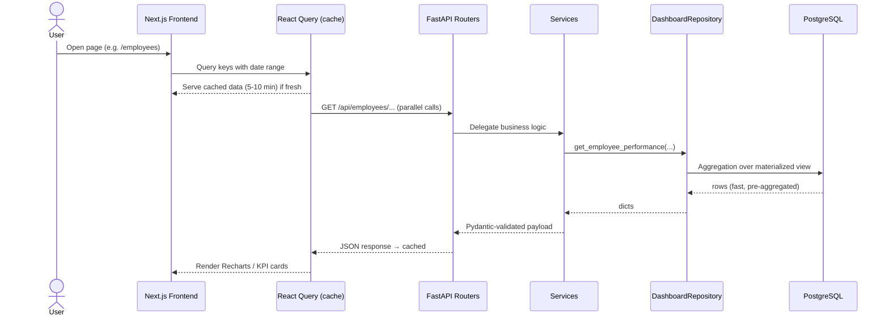
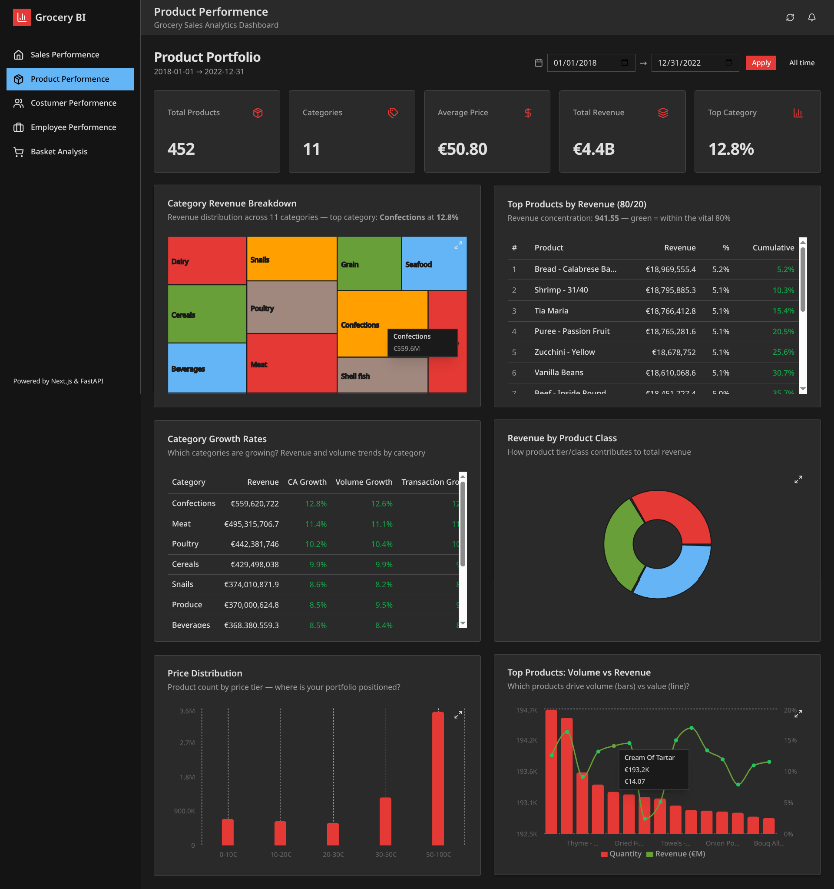
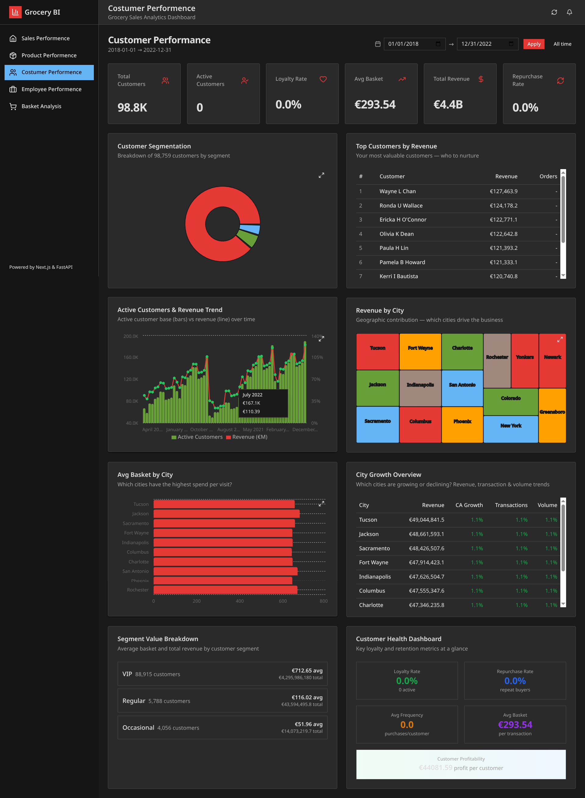
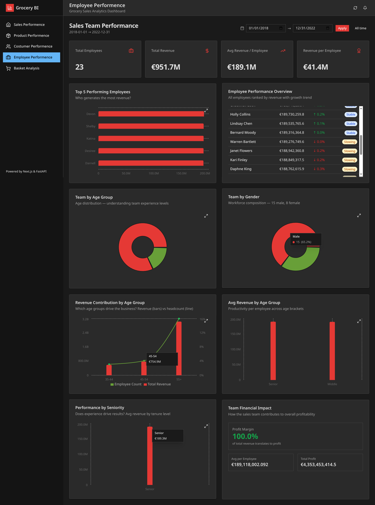
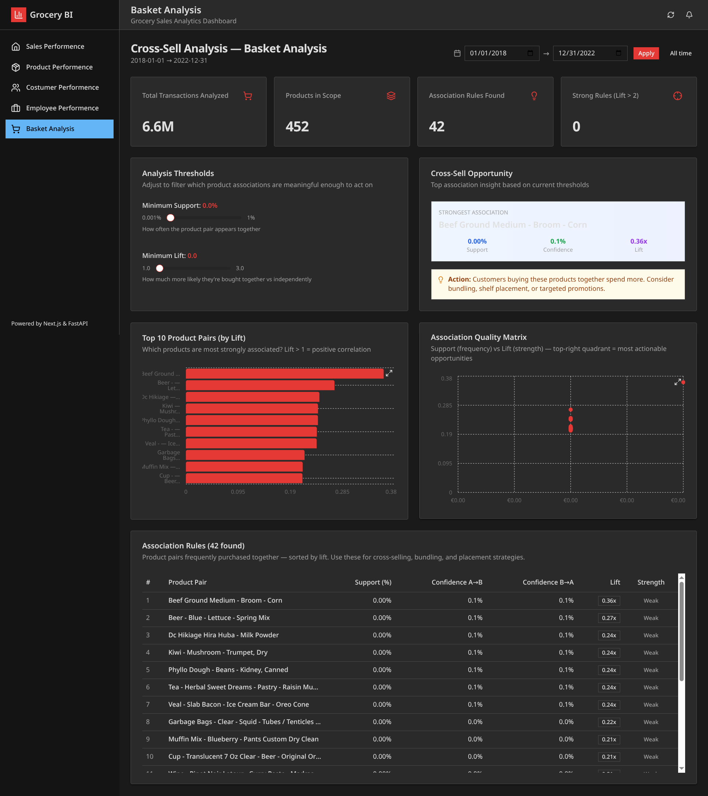
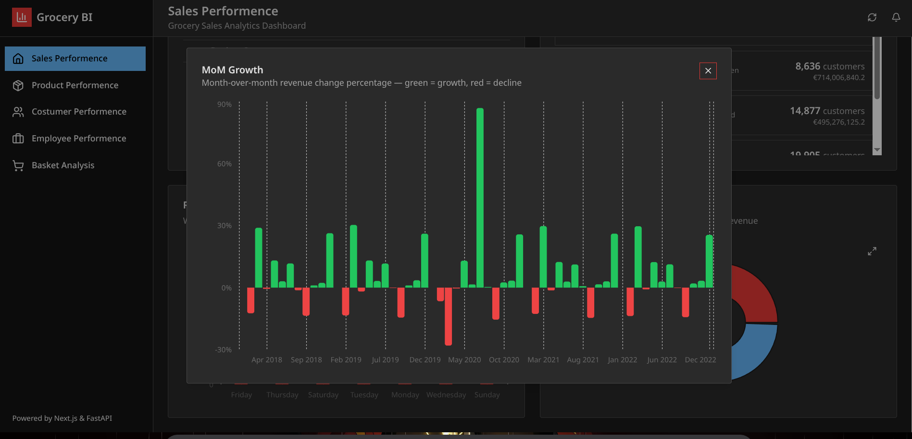

# 🛒 Grocery Sales Dashboard

> **Approach 2 (Code)** — A modern, open-source web dashboard that rebuilds a full Power BI reporting suite for grocery sales. FastAPI + Next.js + PostgreSQL, serving **5 interactive analytics dashboards** over **6.7M transactions**.



---

## 📖 Overview

**Grocery Sales Dashboard** is a full-stack business intelligence application that turns raw grocery transaction data into actionable insights. It replicates the five Power BI dashboards from the parent project (`PowerBI Version/`) as a fast, interactive, code-driven web application — no proprietary BI tool required.

It is built for **retail analysts and business managers** who need to monitor:

- **Sales performance** — revenue, profit, trends and financial health
- **Product portfolio** — categories, pricing, 80/20 concentration
- **Customer behavior** — RFM segmentation, loyalty, geography
- **Employee productivity** — team performance and demographics
- **Market basket analysis** — product associations for cross-selling

The frontend is a **Next.js (App Router)** application powered by **Recharts** and **TanStack Query**; the backend is a **layered FastAPI** service querying a **PostgreSQL star schema** optimized with materialized views. Together they deliver sub-second dashboard loads over a ~6.7M-row fact table.

---

## 🎯 The Problem

Retail analytics typically lives inside **proprietary, closed-source BI platforms**:

- 📊 **Licensing costs** — every viewer needs a paid seat (e.g., Power BI Pro).
- 🔌 **No code-level control** — hard to embed, extend, or version-control.
- 🐢 **Slow iteration** — visual changes require the desktop tool and manual refreshes.
- 🧩 **Siloed analyses** — sales, products, customers, employees and basket analysis live in separate reports instead of one coherent application.
- 📉 **Performance** — naive queries over multi-million-row fact tables make dashboards laggy.

For a grocery dataset with **6.69M sales transactions**, any dashboard layer must also answer "how do we keep this fast?" — the answer can't be brute-force aggregation on every page load.

---

## 💡 The Solution

A **two-tier modern web application** where the entire Power BI workflow is re-implemented in open-source code:

```
   Power BI reports           →        Next.js + Recharts pages
   Power Query / DAX          →        FastAPI + SQLAlchemy repositories
   Star schema tables         →        PostgreSQL schema + ETL pipeline
   Manual refresh             →        Auto-loading ETL + cached APIs
```

**Business value delivered:**

- **One URL, every report** — Sales, Products, Customers, Employees and Basket Analysis under a single sidebar, with a **global date-range filter** and per-chart filters.
- **Code-first and free** — the whole pipeline is version-controlled, reproducible and runs on free tooling.
- **Fast by design** — materialized views, composite indexes, pre-computed association rules and client caching keep page loads fast even over 6.7M rows.
- **Actionable, not just pretty** — Pareto (80/20) analysis, RFM segments, MoM growth alerts, and lift-based cross-sell opportunities guide decisions.

---

## 📈 System Impact

### Key Performance Metrics (analyzed period)

| Metric | Value |
|--------|-------|
| 💰 Total Revenue (computed `qty × price`) | **€4.42B** |
| 🧾 Sales transactions | **6,690,599** |
| 👥 Active customers | **98,759** |
| 📦 Products sold | **452** (0 dead stock ✅) |
| 🏷️ Product categories | **11** |
| 👔 Active employees | **23** |

### Performance Improvements over Naive BI

| Technique | Impact |
|-----------|--------|
| **Materialized views** (`mv_daily_sales`, `mv_monthly_sales`, `mv_customer_segmentation`, `mv_top_products`, `mv_employee_performance`) | Pre-aggregated — ~99.9% fewer rows scanned per query |
| **Composite indexes** on `fact_sales(date, productid)`, `(date, employeeid)`, `(date, customerid)` | Fast filtered aggregations on the 6.7M-row fact table |
| **Pre-computed basket rules** (`basket_analysis_results`, 75K+ rules) | Market-basket queries run in milliseconds instead of mining 6.7M baskets live |
| **SQLAlchemy connection pool (20)** + `pool_pre_ping` | Handles 15+ concurrent dashboard API calls without reconnecting |
| **TanStack Query caching** (5–10 min stale times) + **backend in-memory cache (300s)** | Repeated dashboard loads skip redundant work |
| **PostgreSQL `COPY` bulk loading** | CSV→DB import ~10–50× faster than row-by-row `INSERT` |

### Expected Outcomes

- Cross-selling actions from top association rules (bundling, shelf placement, targeted promos).
- Focused marketing on the **VIP segment** (98.7% of revenue) and **top cities/customers**.
- 80/20 portfolio management via the Pareto tables.
- Staff coaching targeted via employee performance & seniority views.

---

## 🚀 Core Features

| # | Page | What it does |
|---|------|--------------|
| 1 | **Sales Dashboard** (`/`) | 6 KPIs (Revenue, Profit, Quantity, Transactions, Margin, Avg Basket), revenue & profit combo trend, MoM growth (green/red), category treemap, Pareto table, RFM segments, revenue by day-of-week & product class |
| 2 | **Product Portfolio** (`/products`) | Product KPIs, category revenue treemap, category growth table, price distribution, price-vs-volume scatter, top products by volume/value |
| 3 | **Customer Analytics** (`/customers`) | Segmentation donut (VIP/Regular/Occasional), top customers, active-customer & revenue trend, city treemap, avg basket by city, city growth overview, loyalty/health KPIs |
| 4 | **Employee Performance** (`/employees`) | Team KPIs, top-5 performers, performance overview table, team by age & gender, revenue contribution by age group, performance by seniority, financial impact |
| 5 | **Basket Analysis** (`/basket-analysis`) | **Support & Lift threshold sliders**, strongest-association insight, top 10 pairs by lift, association quality matrix (lift vs confidence), lift distribution histogram, hub products, category affinities, knowledge-graph product links, sortable 42-rule table |

### User Interactions

- 🌍 **Global date-range filter** applied across every page + "Apply".
- 🎚️ **Threshold sliders** (Minimum Support %, Minimum Lift) that live-filter basket associations.
- 🔍 **Per-chart filters** (category, product, chart-level) via `ChartFilterBar`.
- 🖼️ **Expandable charts** — every chart opens as a focused modal (`ExpandableChart`).
- 🔎 **Sortable, scrollable data tables** for rules, top products and top customers.

---

## ✨ Elite Features ⭐

- **🤝 Market Basket Analysis at scale** — 75,000+ pre-computed association rules (support, confidence, lift) mined offline and served instantly, with interactive support/lift thresholds that re-rank results on the fly.
- **🧠 "Strongest Association" smart insight** — the UI surfaces the single most actionable product pair and suggests concrete actions (bundle, shelf placement, targeted promotion).
- **🕸️ Knowledge-graph product links** — a network visualization where edge width = lift strength, revealing cross-sell clusters at a glance.
- **📐 Pareto (80/20) engine** — flags the "vital 80%" of revenue so teams know exactly which few products matter most (concentration index shown).
- **🧩 RFM segmentation (Recency-Frequency-Monetary)** — customers automatically bucketed into Champions, VIPs, Actives, Need Attention, etc., each with a plain-language description.
- **⚡ Layered architecture** — API → Service → Repository → ORM separation, dependency-injected DB sessions, Pydantic-validated schemas, and a single repository that falls back from materialized views to the fact table when filters escape the view range.
- **🛠️ Full ETL sidecar** — `Extractor → Transformer → Validator → Loader → Sync` pipeline (pandas + `COPY`), with data-quality rules (null-date removal, dedup, enrichment joins) and DB integrity checks.
- **🖥️ Recharts, not static images** — treemaps, scatter matrices, waterfalls, combos and doughnuts all rendered client-side for instant interactivity.
- **📱 Polished dark UI** — shadcn/ui + Tailwind, expandable chart modals, skeletons while loading, and an accessible sidebar/topnav shell.

---

## 🛠 Technology Stack

| Layer | Technology | Role |
|-------|-----------|------|
| **Frontend** | Next.js 14 (App Router) · React 18 · TypeScript | UI framework & typing |
| | Tailwind CSS · shadcn/ui · tw-animate-css | Styling & accessible primitives |
| | Recharts · react-chartjs-2 | Interactive charting (bar, line, treemap, scatter, combo…) |
| | TanStack React Query | Server-state caching & auto-refetch |
| | date-fns · Lucide / Tabler icons · clsx | Utilities & icons |
| **Backend** | FastAPI · Uvicorn | REST API & async server |
| | SQLAlchemy 2 · Alembic | ORM & migrations |
| | Pydantic v2 · pydantic-settings | Schema validation & config |
| | pandas · numpy | ETL transform engine |
| | httpx | Internal API calls |
| **Database** | PostgreSQL 16 | Data warehouse |
| | Star schema + materialized views + composite indexes | Analytical query performance |
| **Dev Tools** | Bun · Python venv · Git · Docker (optional) | Package managers & tooling |

---

## ⚙️ Architecture / Workflow

```
┌──────────────────────────────────────────────────────────────┐
│                         USER (Browser)                        │
└───────────────────────────┬──────────────────────────────────┘
                            ▼
┌──────────────────────────────────────────────────────────────┐
│                  NEXT.JS FRONTEND (:3000)                     │
│   Pages (5) → Hooks (TanStack Query) → services/api.ts        │
│   Recharts components + shadcn/ui + FilterBar/Sliders         │
└───────────────────────────┬──────────────────────────────────┘
                            │  REST (JSON) — /api/*
                            ▼
┌──────────────────────────────────────────────────────────────┐
│                    FASTAPI BACKEND (:8000)                    │
│   Routers: dashboard · sales · products · customers           │
│            employees · basket · filters · insights            │
│   Services (business logic)                                   │
│   DashboardRepository (all data access)                       │
│   SQLAlchemy ORM + Pydantic schemas                           │
└───────────────────────────┬──────────────────────────────────┘
                            ▼
┌──────────────────────────────────────────────────────────────┐
│                    POSTGRESQL 16 (5432)                       │
│   dim_category · dim_product · dim_customer · dim_employee    │
│   dim_date · fact_sales (6.7M rows)                           │
│   Materialized views · indexes · basket_analysis_results      │
└──────────────────────────────────────────────────────────────┘

┌──────────────────────────────────────────────────────────────┐
│                    ETL SIDECAR (scripts/)                     │
│   Extractor → Transformer → Validator → Loader → Sync        │
│   CSV (7 files) ──► star-schema PostgreSQL + views           │
└──────────────────────────────────────────────────────────────┘
```

### Request flow (a single dashboard load)



> Full class, sequence and ETL diagrams: see [`ARCHITECTURE.md`](ARCHITECTURE.md). Data-flow details: [`backend/README.md`](backend/README.md) and [`backend/ETL_PIPELINE.md`](backend/ETL_PIPELINE.md).

---

## 🧠 Development Journey

### Biggest challenges

- **6.7M-row fact table** — naive `GROUP BY` queries made dashboards crawl. Solved by designing **materialized views** that pre-aggregate daily/monthly/segment/product/employee facts, plus composite indexes, so page loads stay sub-second.
- **Basket analysis cost** — mining association rules over 6.7M baskets on every request is infeasible. Solved by **offline pre-computation** of 75,000+ rules (support/confidence/lift) into a dedicated table, then exposing instant, threshold-filtered queries.
- **Rebuilding a Power BI suite in code** — every Power Query transform and DAX measure had to be re-derived in SQL/Python. Solved with a clean **layered backend** (API → Service → Repository) where each KPI maps to a single, well-named query.
- **Data quality in the source CSV** — `TotalPrice` was 0 in the source, requiring revenue to be **recomputed as `qty × price`** (defense-in-depth), and ~67K rows with null sale dates had to be cleaned before loading.
- **15+ simultaneous API calls per page** — solved with **TanStack Query** deduplication/caching plus backend in-memory caching (300s TTL) and SQLAlchemy connection pooling.

### Interesting technical decisions

- **One repository for everything** (`DashboardRepository`) instead of one per entity — cross-table analytical queries are simpler and avoid circular dependencies.
- **Fallback strategy**: repositories query materialized views first, then gracefully fall back to `fact_sales` when a date filter falls outside the view range.
- **Generated `full_name` columns** in PostgreSQL (`GENERATED ALWAYS AS … STORED`) keep names consistent in SQL without app logic.
- **Denormalized `categoryname` in `dim_product`** — a classic DW optimization that removes a join from almost every product query.
- **Bun over npm** for faster frontend installs/scripts.

---

## 📚 What I Learned

**Technical**
- Star-schema modeling and when to denormalize for analytical speed.
- Materialized views + composite indexes as the first line of defense for multi-million-row reporting.
- Association-rule mining (support / confidence / lift) and pre-computation as an architectural pattern.
- Layered FastAPI design with dependency-injected sessions and Pydantic contracts.

**Design**
- A consistent dark UI with clear KPI hierarchy makes dense dashboards scannable.
- Expandable charts and chart-level filters keep one page from becoming overloaded.

**Architecture**
- Separating API → Service → Repository kept a 5-domain dashboard maintainable and testable.
- Caching belongs at both ends — backend result cache and client-side query cache.

**Problem Solving**
- When a query is too slow, don't tune it — **reduce the data it must touch** (pre-aggregate) or **avoid computing it live** (pre-compute).

---

## ⚡ Getting Started

### Prerequisites

- **PostgreSQL** 16+ (running)
- **Python** 3.12 or 3.13 (not 3.14 — some wheels unavailable)
- **Bun** — `curl -fsSL https://bun.sh/install | bash`
- **Git**

> 📄 A Docker-based quick start is described in [`how to start.md`](how%20to%20start.md); the canonical local setup below mirrors [`SETUP_LOCAL.md`](SETUP_LOCAL.md).

### 1 · Database (PostgreSQL)

```bash
sudo systemctl start postgresql

sudo -u postgres psql -c "CREATE DATABASE grocery_sales;"
sudo -u postgres psql -c "ALTER USER postgres PASSWORD 'postgres';"

# Create schema: tables, views, indexes, basket results
sudo -u postgres psql -d grocery_sales -f database/schema.sql

# Verify
sudo -u postgres psql -d grocery_sales -c "\dt"
# → dim_category, dim_product, dim_customer, dim_employee, dim_date, fact_sales
```

### 2 · Backend (FastAPI)

```bash
cd backend
python3 -m venv .venv && source .venv/bin/activate
pip install --only-binary :all: -r requirements.txt   # wheels only to avoid build issues
uvicorn app.main:app --reload --host 0.0.0.0 --port 8000
```

- API: **http://localhost:8000** · Interactive docs: **http://localhost:8000/api/docs**

### 3 · Load the data (ETL)

```bash
cd backend && source .venv/bin/activate

# Fastest: pre-processed CSVs → PostgreSQL (safe to re-run, truncates first)
python scripts/load_all_data.py

# Alternative: full extract → transform → validate → load
python scripts/run_pipeline.py
```

Then create the daily-baskets materialized view and load the pre-computed basket rules:

```bash
PGPASSWORD=postgres psql -h localhost -U postgres -d grocery_sales -c "
CREATE MATERIALIZED VIEW IF NOT EXISTS mv_daily_baskets AS
SELECT DISTINCT customerid,
       CONCAT(customerid, '|', date) AS basket_id,
       productid
FROM fact_sales;
CREATE UNIQUE INDEX IF NOT EXISTS idx_mv_db ON mv_daily_baskets(customerid, basket_id, productid);
CREATE INDEX IF NOT EXISTS idx_mv_db_basket ON mv_daily_baskets(basket_id);
"

PGPASSWORD=postgres psql -h localhost -U postgres -d grocery_sales \
  -f '../Dashboard Version/backend/scripts/load_basket_table.sql'
```

### 4 · Frontend (Next.js)

```bash
cd frontend
bun install
bun run dev          # → http://localhost:3000
```

### Environment Variables

| File | Variable | Default |
|------|----------|---------|
| `backend/.env` | `POSTGRES_USER` / `POSTGRES_PASSWORD` / `POSTGRES_HOST` / `POSTGRES_PORT` / `POSTGRES_DB` | `postgres` / `postgres` / `localhost` / `5432` / `grocery_sales` |
| `backend/.env` | `DEBUG` · `CORS_ORIGINS` | `true` · `["http://localhost:3000"]` |
| `frontend/.env.local` | `NEXT_PUBLIC_API_URL` | `http://localhost:8000` |

### Run Development Server

| Service | URL | Command |
|---------|-----|---------|
| Frontend | http://localhost:3000 | `cd frontend && bun run dev` |
| Backend API | http://localhost:8000 | `cd backend && uvicorn app.main:app --reload` |
| API Docs | http://localhost:8000/api/docs | — |
| PostgreSQL | localhost:5432 | `sudo systemctl start postgresql` |

### Build Production

```bash
# Frontend
cd frontend
bun run build        # Next.js production build
bun run start        # serve at http://localhost:3000

# Backend
cd backend
uvicorn app.main:app --host 0.0.0.0 --port 8000
```

### Verify

```bash
curl http://localhost:8000/api/health
# {"status":"healthy","app":"Grocery Sales Dashboard API","version":"1.0.0"}
```

---

## 🖼 Screenshots

| Dashboard | Preview |
|-----------|---------|
| Sales Performance |  |
| Product Portfolio |  |
| Customer Analytics |  |
| Employee Performance |  |
| Basket Analysis |  |
| Expandable Chart Modal |  |

---

## 🔮 Future Improvements

- **Async backend** — migrate SQLAlchemy to the async engine (URLs already prepared in config).
- **Authentication & roles** — analyst vs. admin dashboards with per-user saved filters.
- **Live refresh** — scheduled materialized-view refresh + incremental ETL on new CSV batches.
- **Forecasting integration** — surface the ML revenue forecast from the parent PowerBI project (`AI/`) inside the web app.
- **More basket mining** — expose threshold presets, exportable rule sets, and shopping-list recommendations per product.
- **Unit & integration tests** — expand coverage across services and repositories.
- **Docker Compose** — one-command full-stack startup for onboarding.

---

## 📄 License

This project is an academic/educational BI implementation. All rights to the underlying dataset belong to its original authors (see the Kaggle *Grocery Sales Dataset*). Reuse the code freely for learning purposes; verify dataset licensing before commercial use.

---

## 👨‍💻 Author

Built as **Approach 2 (Code)** of the *Grocery BI — Sales Analysis* project at the **Faculté des Sciences et Techniques de Tanger — Université Abdelmalek Essaâdi**.

- 📁 Repository home: [`../README.md`](../README.md)
- 🔗 Sibling approach: [`../PowerBI Version/`](../PowerBI%20Version/) (Apache Hop → PostgreSQL → Power BI → Data Mining → ML)
- 🖥️ Demo screenshots & reports: [`../Rapport + PPT/`](../Rapport%20+%20PPT/)

---

*Powered by Next.js & FastAPI · PostgreSQL · Recharts · TanStack Query*
