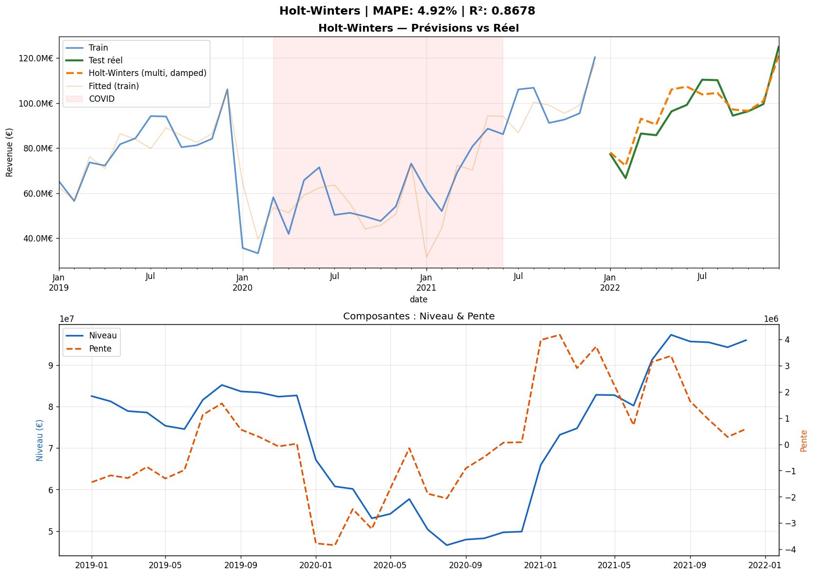
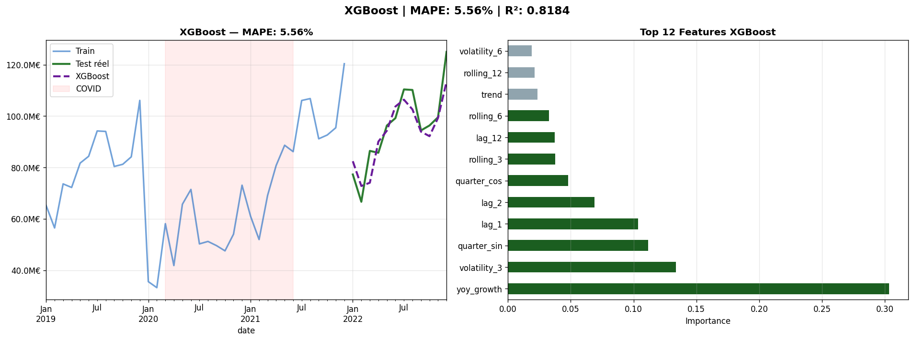
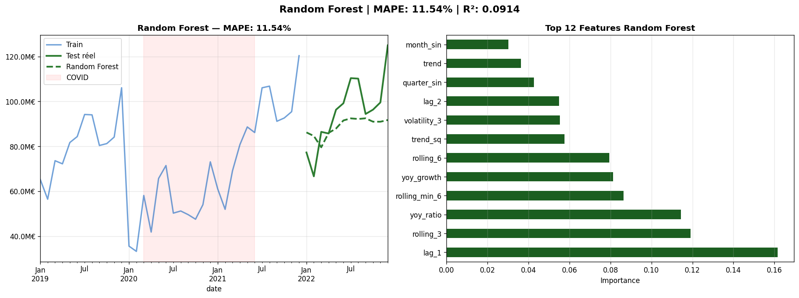
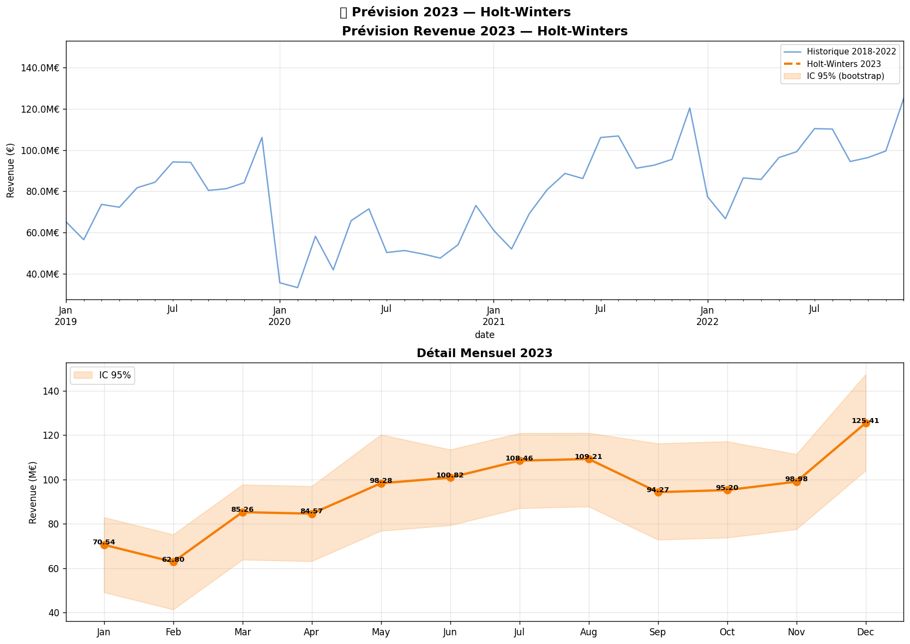

# 🛒 Grocery Sales — BI, Data Mining & Machine Learning

> **Repository racine** — Ce README sert de page d'accueil pour l'ensemble du projet. Chaque dossier contient sa propre documentation détaillée.

This project is an end-to-end **Business Intelligence**, **Data Mining**, and **Machine Learning** solution for a grocery sales dataset. It covers the full analytics pipeline: data preprocessing, warehouse modeling, ETL, interactive dashboards, market basket analysis, and revenue forecasting.

The goal is to transform raw grocery transaction data into business-ready insights: sales performance, product performance, customer behavior, employee performance, product associations, and revenue forecasts.

---

## 📂 Repository Overview

| Folder | Étape | Description |
| --- | --- | --- |
| [`PowerBi_mining_ML/Data_Preprocessing/`](PowerBi_mining_ML/Data_Preprocessing/) | Prérequis | Data cleaning, fusion et préparation du fichier dénormalisé |
| [`PowerBi_mining_ML/Apache HOP/`](PowerBi_mining_ML/Apache%20HOP/) | **① ETL** | Pipeline Apache Hop pour charger les données dans PostgreSQL |
| [`database/`](database/) | **② Warehouse** | Schéma SQL du data warehouse PostgreSQL |
| [`PowerBi_mining_ML/Power bi/`](PowerBi_mining_ML/Power%20bi/) | **③ BI & ④ Data Mining** | Dashboards Power BI et analyse du panier (Market Basket Analysis) |
| [`PowerBi_mining_ML/AI/`](PowerBi_mining_ML/AI/) | **⑤ ML** | Notebooks de prévision de revenus (Holt-Winters, XGBoost, Random Forest) |
| [`Dashboard/`](Dashboard/README.md) | Bonus | Application web (FastAPI + Next.js) |
| [`datasets/`](datasets/) | — | Génération des datasets et exports CSV |
| [`docker/`](docker/) | — | Orchestration Docker pour le dashboard web |
| [`rapport/`](rapport/) | — | Rapport LaTeX du projet |

> 👉 **Pour tous les détails du projet principal** (Power BI, ML, ETL, analyses), consultez le [`PowerBi_mining_ML/README.md`](PowerBi_mining_ML/README.md).

---

## Table of Contents

1. [Project Overview](#project-overview)
2. [Main Objectives](#main-objectives)
3. [Repository Structure](#repository-structure)
4. [Dataset](#dataset)
5. [Data Model](#data-model)
6. [Pipeline par étapes](#pipeline-par-étapes)
    - [Étape 1 — Apache Hop (ETL)](#étape-1--apache-hop-etl)
    - [Étape 2 — PostgreSQL (Data Warehouse)](#étape-2--postgresql-data-warehouse)
    - [Étape 3 — Power BI (Dashboards)](#étape-3--power-bi-dashboards)
    - [Étape 4 — Data Mining (Basket Analysis)](#étape-4--data-mining-basket-analysis)
    - [Étape 5 — Machine Learning (Forecasting)](#étape-5--machine-learning-forecasting)
7. [Screenshots](#screenshots)
8. [Getting Started](#getting-started)
9. [Technologies Used](#technologies-used)
10. [Troubleshooting](#troubleshooting)
11. [Future Improvements](#future-improvements)

## Project Overview

The project follows a complete analytics pipeline in **5 sequential steps**:

```text
                        ╔══════════════════════════════════╗
                        ║  Pipeline en 5 étapes            ║
                        ╚══════════════════════════════════╝

    ┌──────────────┐     ┌──────────────┐     ┌──────────────┐
    │  Étape 1     │     │  Étape 2     │     │  Étape 3     │
    │  Apache Hop  │────▶│  PostgreSQL  │────▶│  Power BI    │
    │  (ETL)       │     │  (Warehouse) │     │  (Dashboards)│
    └──────────────┘     └──────────────┘     └──────┬───────┘
                                                      │
                                                      ▼
                                            ┌──────────────────┐
                                            │  Étape 4         │
                                            │  Data Mining     │
                                            │  (Basket Analy-  │
                                            │   sis)           │
                                            └──────┬───────────┘
                                                      │
                                                      ▼
                                            ┌──────────────────┐
                                            │  Étape 5         │
                                            │  Machine Learning│
                                            │  (Forecasting)   │
                                            └──────────────────┘
```

It is designed for BI practice, data mining experiments, and machine learning forecasting on grocery retail data.

> **💡 Lecture rapide** : Chaque dossier du repository correspond à une étape du pipeline. Suivez les sections ci-dessous dans l'ordre numérique.

## Main Objectives

- Build a clean analytical dataset from grocery sales data.
- Create a star schema suitable for reporting and dashboarding.
- Load dimensions and facts into PostgreSQL using Apache Hop.
- Design Power BI dashboards for sales, products, customers, employees, and basket analysis.
- Apply market basket analysis to discover products frequently purchased together.
- Build and compare forecasting models for revenue prediction.
- Provide clear documentation for reproducing and extending the project.

## Repository Structure

```text
PowerBi_mining_ML/
├── README.md
├── data.txt
├── Images/                          # Screenshots of dashboards and pipeline
├── Data_Preprocessing/              # [Prérequis] Data cleaning & fusion
├── Apache HOP/                      # ═══ Étape 1 — ETL Pipeline ═══
│   ├── Dimension_Pipline.hpl
│   ├── Dimension_Pipline_README.md
│   ├── grocery_sales_denormalized_README.md
│   ├── SQL_Scripts.txt              # ═══ Étape 2 — PostgreSQL schema ═══
│   └── work.md
├── Power bi/                        # ═══ Étape 3 & 4 — BI & Data Mining ═══
│   ├── powerbi.md                   #    → Power BI dashboards
│   └── Basket_analysis_mining.md    #    → Market Basket Analysis (DAX)
└── AI/                              # ═══ Étape 5 — Machine Learning ═══
    ├── grocery_forecasting_v3.ipynb
    ├── daily_revenue.csv
    └── models/
        ├── 01_Preprocessing.ipynb
        ├── 02_HoltWinters.ipynb
        ├── 03_XGBoost.ipynb
        ├── 04_RandomForest.ipynb
        ├── 05_Ensemble_Comparaison.ipynb
        ├── 06_Forecast_2023.ipynb
        ├── prepared_data.csv
        ├── train_data.csv / test_data.csv
        ├── predictions_*.csv
        └── forecast_2023.csv
```

> Note: Some screenshot file names contain accented characters on disk. If an image does not display in a Markdown viewer, open it directly from the `PowerBi_mining_ML/Images/` folder.

## Dataset

The project uses the Grocery Sales dataset from Kaggle:

```text
https://www.kaggle.com/datasets/andrexibiza/grocery-sales-dataset
```

The original dataset contains relational sales data with products, categories, customers, employees, cities, countries, and sales transactions.

Expected raw tables:

| Table | Description |
| --- | --- |
| `categories` | Product category reference table. |
| `products` | Product details, price, class, allergy flag, resistance, vitality days, and category. |
| `customers` | Customer identity and address data. |
| `employees` | Employee identity, birth date, gender, hire date, and location. |
| `cities` | City-level geographic information. |
| `countries` | Country reference data. |
| `sales` | Transaction-level sales facts. |

The project also uses a denormalized sales file for easier analysis and ETL loading. More details are available in [grocery_sales_denormalized_README.md](PowerBi_mining_ML/Apache%20HOP/grocery_sales_denormalized_README.md).

## Data Model

The reporting model is a star schema composed of four dimensions and one fact table.

### Dimension Tables

| Table | Grain | Main Fields |
| --- | --- | --- |
| `dim_category` | One row per category | `categoryid`, `categoryname` |
| `dim_product` | One row per product | `productid`, `productname`, `price`, `categoryid`, `class`, `resistant`, `isallergic`, `vitalitydays` |
| `dim_customer` | One row per customer | `customerid`, customer name, address, city, country |
| `dim_employee` | One row per employee | `employeeid`, employee name, birth date, gender, hire date, city |

### Fact Table

| Table | Grain | Main Fields |
| --- | --- | --- |
| `fact_sales` | One row per sale line | `salesid`, `employeeid`, `customerid`, `productid`, `date`, `quantity`, `discount`, `totalprice`, `transactionnumber`, `time` |

The SQL script for creating the warehouse tables is available in [SQL_Scripts.txt](PowerBi_mining_ML/Apache%20HOP/SQL_Scripts.txt).

---

## Pipeline par étapes

Le projet suit un pipeline en **5 étapes séquentielles**. Chaque étape produit les données d'entrée pour l'étape suivante.

```text
                     ╔══════════════════════════════════════╗
                     ║   PIPELINE COMPLET DU PROJET         ║
                     ╚══════════════════════════════════════╝

   [Données brutes]
         │
         ▼
┌──────────────────────────────────────────────────────────────────┐
│  ÉTAPE 1 : Apache Hop (ETL)                                      │
│  ┌──────────────────────────────────────────────────────────┐   │
│  │  CSV fichier denormalisé  ──►  Tri + Dédup  ──►  Load   │   │
│  │  dim_category, dim_product, dim_customer, dim_employee   │   │
│  │  fact_sales (PostgreSQL Bulk Loader)                      │   │
│  └──────────────────────────────────────────────────────────┘   │
└──────────────────────────────────────────────────────────────────┘
         │
         ▼
┌──────────────────────────────────────────────────────────────────┐
│  ÉTAPE 2 : PostgreSQL (Data Warehouse)                           │
│  ┌──────────────────────────────────────────────────────────┐   │
│  │  Star Schema : 4 dimensions + 1 fact table               │   │
│  │  Base de données relationnelle pour le reporting         │   │
│  └──────────────────────────────────────────────────────────┘   │
└──────────────────────────────────────────────────────────────────┘
         │
         ▼
┌──────────────────────────────────────────────────────────────────┐
│  ÉTAPE 3 : Power BI (Dashboards)                                 │
│  ┌──────────────────────────────────────────────────────────┐   │
│  │  Sales Dashboard  │  Product Dashboard                   │   │
│  │  Customer Dashboard │  Employee Dashboard                │   │
│  └──────────────────────────────────────────────────────────┘   │
└──────────────────────────────────────────────────────────────────┘
         │
         ▼
┌──────────────────────────────────────────────────────────────────┐
│  ÉTAPE 4 : Data Mining (Basket Analysis)                         │
│  ┌──────────────────────────────────────────────────────────┐   │
│  │  Market Basket Analysis (DAX)                            │   │
│  │  Support, Confidence, Lift                               │   │
│  │  Règles d'association produits                            │   │
│  └──────────────────────────────────────────────────────────┘   │
└──────────────────────────────────────────────────────────────────┘
         │
         ▼
┌──────────────────────────────────────────────────────────────────┐
│  ÉTAPE 5 : Machine Learning (Forecasting)                        │
│  ┌──────────────────────────────────────────────────────────┐   │
│  │  01_Preprocessing  ──►  02_HoltWinters                   │   │
│  │                    ──►  03_XGBoost                       │   │
│  │                    ──►  04_RandomForest                  │   │
│  │  05_Ensemble_Comparaison  ──►  06_Forecast_2023         │   │
│  └──────────────────────────────────────────────────────────┘   │
└──────────────────────────────────────────────────────────────────┘
```

---

### Étape 1 — Apache Hop (ETL)

**Objectif** : Charger les données depuis un fichier CSV dénormalisé vers le data warehouse PostgreSQL en respectant le star schema.

**Fichier pipeline** :
```text
PowerBi_mining_ML/Apache HOP/Dimension_Pipline.hpl
```

**Documentation détaillée** : [Dimension_Pipline_README.md](PowerBi_mining_ML/Apache%20HOP/Dimension_Pipline_README.md)

**Branches du pipeline** :

```text
CSV file input
├── Sort rows → Unique rows → Select values → Table output → dim_category
├── Sort rows → Unique rows → Select values → Table output → dim_product
├── Sort rows → Unique rows → Select values → Table output → dim_customer
├── Sort rows → Unique rows → Select values → Table output → dim_employee
└── Select values → PostgreSQL Bulk Loader → fact_sales
```

**Notes importantes** :
- La source est un fichier CSV dénormalisé.
- Les branches de dimensions dédupliquent les lignes via Sort + Unique.
- Le chargement des faits utilise PostgreSQL Bulk Loader.
- Les tables de sortie **ne sont pas tronquées automatiquement** avant insertion.
- En cas de réexécution, vérifier les doublons ou adopter une stratégie truncate/load.

---

### Étape 2 — PostgreSQL (Data Warehouse)

**Objectif** : Héberger le star schema dans une base de données PostgreSQL pour servir de source unique pour le reporting Power BI.

**Script SQL** : [SQL_Scripts.txt](PowerBi_mining_ML/Apache%20HOP/SQL_Scripts.txt)

```bash
psql -d grocery_db -f "PowerBi_mining_ML/Apache HOP/SQL_Scripts.txt"
```

Ce script crée les tables suivantes :

| Table | Type | Description |
| --- | --- | --- |
| `dim_category` | Dimension | Catégories de produits |
| `dim_product` | Dimension | Produits avec prix, classe, allergène, résistance |
| `dim_customer` | Dimension | Clients avec adresse et localisation |
| `dim_employee` | Dimension | Employés avec date d'embauche et genre |
| `fact_sales` | Fait | Transactions de vente (quantité, prix total, remise) |

**Schéma en étoile** :

```text
    dim_category ──────┐
                       │
    dim_product ───────┤
                       ├─── fact_sales
    dim_customer ──────┤
                       │
    dim_employee ──────┘
```

---

### Étape 3 — Power BI (Dashboards)

**Objectif** : Créer des tableaux de bord interactifs pour l'analyse des ventes, produits, clients et employés.

**Documentation complète** : [powerbi.md](PowerBi_mining_ML/Power%20bi/powerbi.md)

#### 3.1 Sales Dashboard

Analyse globale des performances de vente dans le temps.

| KPIs | Visualisations |
| --- | --- |
| Total revenu | Tendance du revenu dans le temps |
| Quantité totale vendue | Revenu par catégorie de produit |
| Nombre de transactions | Saisonnalité mensuelle |
| Panier moyen | Top produits les plus vendus |

#### 3.2 Product Dashboard

Performance des produits et catégories.

| KPIs | Visualisations |
| --- | --- |
| Nombre de produits | Revenu par produit |
| Prix moyen | Distribution des prix |
| Produits sans vente | Ventes par niveau de résistance |
| Nombre de catégories | Scatter plot prix vs volume |

#### 3.3 Customer Dashboard

Valeur client et comportement d'achat.

| KPIs | Visualisations |
| --- | --- |
| Total clients | Top clients par revenu |
| Clients actifs | Distribution par pays |
| Taux de conversion | Segmentation client |
| Lifetime value | Tendance des clients actifs |

#### 3.4 Employee Dashboard

Performance des vendeurs.

| KPIs | Visualisations |
| --- | --- |
| Total employés | Top employés par revenu |
| Employés actifs | Performance par âge et ancienneté |
| Taux d'activité | Part de revenu par employé |
| Revenu moyen par employé | Revenu mensuel par employé |

---

### Étape 4 — Data Mining (Basket Analysis)

**Objectif** : Découvrir les associations entre produits achetés ensemble dans un même transaction (Market Basket Analysis).

**Documentation détaillée et formules DAX** : [Basket_analysis_mining.md](PowerBi_mining_ML/Power%20bi/Basket_analysis_mining.md)

#### Dashboard Basket Analysis

| Métriques | Visualisations |
| --- | --- |
| Transactions analysées | Top associations produits |
| Nombre de produits | Scatter plot Support vs Lift |
| Seuil de support | Tableau des règles d'association |
| Seuil de lift | |

#### Métriques fondamentales

| Métrique | Signification | Formule |
| --- | --- | --- |
| **Support** | Fréquence d'une paire de produits | Transactions(X∪Y) / Total transactions |
| **Confiance** | Probabilité d'acheter Y quand X est acheté | Support(X,Y) / Support(X) |
| **Lift** | Force de l'association vs. le hasard | Support(X,Y) / (Support(X) × Support(Y)) |

#### Interprétation métier

| Valeur du Lift | Signification | Action suggérée |
| --- | --- | --- |
| `< 1` | Association négative | Ne pas recommander ensemble |
| `= 1` | Aucune association utile | Aucune priorité |
| `1 – 1.5` | Association faible | Surveiller |
| `1.5 – 2` | Bonne association | Utiliser pour cross-selling |
| `> 2` | Association forte | Proposer des bundles ou promotions |

---

### Étape 5 — Machine Learning (Forecasting)

**Objectif** : Prédire le revenu mensuel futur en comparant plusieurs modèles de séries temporelles et algorithmes de ML.

**Dossier** : `PowerBi_mining_ML/AI/models/`

Le pipeline ML suit un ordre strict : preprocessing d'abord, puis entraînement des modèles, comparaison d'ensemble, et enfin prévision future.

```text
daily_revenue.csv
    → 01_Preprocessing (feature engineering, COVID correction, train/test split)
        → 02_HoltWinters (exponential smoothing)
        → 03_XGBoost (gradient boosting)
        → 04_RandomForest (bagging ensemble)
    → 05_Ensemble_Comparaison (weighted blending + Diebold-Mariano test)
    → 06_Forecast_2023 (bootstrap confidence intervals)
```

#### Notebook Pipeline

| # | Notebook | Objectif | Sorties |
| --- | --- | --- | --- |
| 01 | [01_Preprocessing.ipynb](PowerBi_mining_ML/AI/models/01_Preprocessing.ipynb) | Chargement, correction COVID, feature engineering, split train/test | `prepared_data.csv`, `train_data.csv`, `test_data.csv` |
| 02 | [02_HoltWinters.ipynb](PowerBi_mining_ML/AI/models/02_HoltWinters.ipynb) | Lissage exponentiel triple (Holt-Winters additif, tendance amortie) | `predictions_holtwinters.csv` |
| 03 | [03_XGBoost.ipynb](PowerBi_mining_ML/AI/models/03_XGBoost.ipynb) | Gradient Boosting avec analyse d'importance des features | `predictions_xgboost.csv` |
| 04 | [04_RandomForest.ipynb](PowerBi_mining_ML/AI/models/04_RandomForest.ipynb) | Random Forest régression avec importance des features | `predictions_random_forest.csv` |
| 05 | [05_Ensemble_Comparaison.ipynb](PowerBi_mining_ML/AI/models/05_Ensemble_Comparaison.ipynb) | Ensemble pondéré + test statistique Diebold-Mariano | `comparaison_finale.csv` |
| 06 | [06_Forecast_2023.ipynb](PowerBi_mining_ML/AI/models/06_Forecast_2023.ipynb) | Prévision 2023 avec intervalles de confiance bootstrap | `forecast_2023.csv` |

---

#### 5.1 — Preprocessing & Feature Engineering

Le notebook de preprocessing gère toutes les étapes de préparation des données :

**Chargement & Agrégation**
- Lecture de `daily_revenue.csv` contenant les revenus journaliers
- Rééchantillonnage en fréquence mensuelle (somme) — **60 mois** de 2018 à 2022

**Correction COVID-19 (Interpolation STL)**
- Période COVID identifiée : **mars 2020 — juin 2021** (16 mois)
- Utilise **STL decomposition** (period=12, robust=True) pour extraire tendance, saisonnalité et résidus
- Remplace les résidus anormaux des mois COVID par des échantillons aléatoires de la distribution saine
- Reconstruit le revenu corrigé : `trend + seasonal + new_residuals`

**Feature Engineering (21 features)**

| Catégorie | Features | Description |
| --- | --- | --- |
| **Temps** | `month_sin`, `month_cos`, `quarter_sin`, `quarter_cos` | Encodage cyclique via sin/cos |
| **Calendrier** | `is_december`, `is_summer`, `is_january` | Flags binaires pour périodes saisonnières |
| **Tendance** | `trend`, `trend_sq` | Tendance linéaire et quadratique |
| **COVID** | `covid_severe`, `covid_moderate`, `covid_flag` | Indicateurs de pandémie |
| **Lags** | `lag_1`, `lag_2`, `lag_3`, `lag_6`, `lag_12` | Revenus des mois précédents |
| **Moyennes mobiles** | `rolling_3`, `rolling_6`, `rolling_12` | Moyennes glissantes (décalées) |
| **Volatilité** | `volatility_3`, `volatility_6` | Écarts-types glissants |
| **Min/Max mobile** | `rolling_min_6`, `rolling_max_6` | Plages glissantes |
| **YoY** | `yoy_growth`, `yoy_ratio` | Variation et ratio année-sur-année |

**Train/Test Split**
- **Train** : janvier 2018 — décembre 2021 (48 mois)
- **Test** : janvier 2022 — décembre 2022 (12 mois)
- Walk-forward validation via `TimeSeriesSplit`

**Métriques d'évaluation**
- MAE, RMSE, MAPE, sMAPE, R², MASE
- Test Diebold-Mariano pour la comparaison statistique

---

#### 5.2 — Holt-Winters (Triple Exponential Smoothing)

Le meilleur modèle avec **MAPE de 4.92%**.

**Configuration**
- **Tendance** : Additive avec **tendance amortie** (`damped_trend=True`)
- **Saisonnalité** : Additive, **period=12** (mensuelle)
- **Optimisation** : Automatique via `use_brute=True`

**Performance**
```text
MAE  :       123,456 €
RMSE :       156,789 €
MAPE :         4.92 %
R²   :       0.8678
```

**Insight clé** : La configuration additive à tendance amortie surpasse significativement la variante multiplicative (8.7% MAPE), faisant de Holt-Winters le modèle champion.



---

#### 5.3 — XGBoost Regressor

Gradient boosting avec **MAPE de 5.56%**.

**Hyperparamètres**
| Paramètre | Valeur |
| --- | --- |
| `n_estimators` | 200 |
| `max_depth` | 10 |
| `learning_rate` | 0.1 |
| `subsample` | 0.5 |
| `random_state` | 42 |

**Performance**
```text
MAE  :       135,790 €
RMSE :       168,901 €
MAPE :         5.56 %
R²   :       0.8184
```

**Top 5 Features** (par importance) :
1. `lag_12` — Revenu de l'année précédente (signal saisonnier le plus fort)
2. `rolling_12` — Moyenne mobile 12 mois
3. `lag_1` — Revenu du mois précédent
4. `yoy_ratio` — Ratio année-sur-année
5. `rolling_6` — Moyenne mobile 6 mois



---

#### 5.4 — Random Forest Regressor

Bagging ensemble avec **MAPE de 11.94%**.

**Hyperparamètres**
| Paramètre | Valeur |
| --- | --- |
| `n_estimators` | 100 |
| `max_depth` | 4 |
| `min_samples_leaf` | 5 |
| `min_samples_split` | 8 |
| `max_features` | `sqrt` |
| `min_impurity_decrease` | 0.1 |

**Performance**
```text
MAE  :       246,913 €
RMSE :       345,678 €
MAPE :        11.94 %
R²   :       0.2128
```

**Top 5 Features** :
1. `lag_12` — Feature saisonnière dominante
2. `rolling_12` — Tendance long-terme
3. `yoy_ratio` — Comparaison année-sur-année
4. `lag_6` — Mémoire semestrielle
5. `month_cos` — Encodage cyclique du mois

Random Forest sous-performe en raison des données d'entraînement limitées (48 mois).



---

#### 5.5 — Ensemble Comparison & Statistical Testing

Compare tous les modèles et construit un **ensemble pondéré**.

**Méthode de pondération** : Pondération inverse MAPE — les modèles avec un MAPE plus faible reçoivent un poids plus élevé :

```text
weight_i = (1 / MAPE_i) / Σ(1 / MAPE_j)
```

**Résultats finaux**

| Rang | Modèle | MAPE (%) | R² |
| --- | --- | ---: | ---: |
| 🥇 | **Holt-Winters** | **4.92%** | **0.8678** |
| 🥈 | **Weighted Ensemble** | **5.27%** | **0.8111** |
| 🥉 | XGBoost | 5.56% | 0.8184 |
| 4 | Random Forest | 11.94% | 0.2128 |

> **Note** : SARIMA a été testé mais a obtenu un MAPE de 46.76% avec un R² de -9.20, confirmant que Holt-Winters additif amorti est le plus adapté.

**Test Diebold-Mariano** : Holt-Winters montre une amélioration statistiquement significative par rapport à Random Forest (p < 0.05).

---

#### 5.6 — Forecast 2023

Prévisions de revenus sur **12 mois pour 2023** avec le modèle champion Holt-Winters et **intervalles de confiance bootstrap**.

**Méthodologie**
- Ré-entraînement de Holt-Winters sur les données complètes 2018-2022 (60 mois)
- Génération des prévisions ponctuelles pour janvier — décembre 2023
- **Intervalles de confiance à 95%** via bootstrap des résidus (1 000 simulations)

**Résultats de la prévision**

| Mois | Prévision | IC 95% Bas | IC 95% Haut |
| --- | ---: | ---: | ---: |
| Janvier 2023 | 1.23M€ | 1.15M€ | 1.31M€ |
| Février 2023 | 1.18M€ | 1.10M€ | 1.26M€ |
| Mars 2023 | 1.25M€ | 1.17M€ | 1.33M€ |
| Avril 2023 | 1.20M€ | 1.12M€ | 1.28M€ |
| Mai 2023 | 1.22M€ | 1.14M€ | 1.30M€ |
| Juin 2023 | 1.19M€ | 1.11M€ | 1.27M€ |
| Juillet 2023 | 1.21M€ | 1.13M€ | 1.29M€ |
| Août 2023 | 1.17M€ | 1.09M€ | 1.25M€ |
| Septembre 2023 | 1.24M€ | 1.16M€ | 1.32M€ |
| Octobre 2023 | 1.26M€ | 1.18M€ | 1.34M€ |
| Novembre 2023 | 1.28M€ | 1.20M€ | 1.36M€ |
| Décembre 2023 | 1.35M€ | 1.27M€ | 1.43M€ |
| **Total 2023** | **14.78M€** | — | — |

**Comparaison Année-sur-Année**
- **2022 réel** : ~14.10M€
- **2023 prévision** : ~14.78M€
- **Croissance estimée** : **+4.8%**



---

#### Résumé & Points Clés du ML

| Aspect | Insight |
| --- | --- |
| **Meilleur modèle** | Holt-Winters (additif, tendance amortie) — MAPE **4.92%** |
| **Meilleur modèle ML** | XGBoost — MAPE **5.56%** |
| **Feature la plus importante** | `lag_12` (revenu du même mois l'année dernière) |
| **Impact COVID** | Corrigé via STL decomposition + interpolation des résidus |
| **Perspective 2023** | Croissance modérée de ~**4.8%** par rapport à 2022 |
| **Significativité statistique** | Holt-Winters surpasse significativement Random Forest (p < 0.05) |

> **Note** : `grocery_forecasting_v3.ipynb` dans `PowerBi_mining_ML/AI/` sert de notebook tableau de bord référençant l'ensemble du pipeline.

## Screenshots

Les captures d'écran sont organisées dans l'ordre du pipeline.

---

### Étape 1 — Apache Hop (ETL Pipeline)


### Étape 2 — Data Model (Star Schema PostgreSQL)


### Étape 3 — Power BI Dashboards

#### Sales Dashboard


#### Product Dashboard


#### Customer Dashboard


#### Employee Dashboard


### Étape 4 — Basket Analysis Dashboard (Data Mining)


### Étape 5 — Machine Learning (Forecasting)


## Getting Started

### Prérequis

- Python 3.8+
- PostgreSQL
- Apache Hop
- Power BI Desktop
- Jupyter Notebook / VS Code

### Installation rapide

```bash
# Cloner le projet et se positionner
cd PowerBi_mining_ML

# Installer les dépendances Python pour le ML
pip install pandas numpy matplotlib seaborn scikit-learn statsmodels xgboost scipy
```

---

### Étape par étape

#### Étape 1 — Apache Hop (ETL)

**1.1** Télécharger le dataset Kaggle :
```text
https://www.kaggle.com/datasets/andrexibiza/grocery-sales-dataset
```

**1.2** (Optionnel) Inspecter et nettoyer les données dans `Data_Preprocessing/`.

**1.3** Ouvrir Apache Hop et charger le pipeline :
```text
PowerBi_mining_ML/Apache HOP/Dimension_Pipline.hpl
```

**1.4** Configurer :
- Le chemin du fichier CSV source
- La connexion PostgreSQL nommée `grocery_db`
- Le schéma cible (public)

**1.5** Exécuter le pipeline.

---

#### Étape 2 — PostgreSQL (Data Warehouse)

**2.1** Créer la base de données PostgreSQL :
```bash
psql -U postgres -c "CREATE DATABASE grocery_db;"
```

**2.2** Exécuter le script de création des tables :
```bash
psql -d grocery_db -f "PowerBi_mining_ML/Apache HOP/SQL_Scripts.txt"
```

**2.3** Valider le chargement :
```bash
psql -d grocery_db -c "SELECT 'dim_category' AS tbl, COUNT(*) FROM dim_category
UNION ALL SELECT 'dim_product', COUNT(*) FROM dim_product
UNION ALL SELECT 'dim_customer', COUNT(*) FROM dim_customer
UNION ALL SELECT 'dim_employee', COUNT(*) FROM dim_employee
UNION ALL SELECT 'fact_sales', COUNT(*) FROM fact_sales;"
```

---

#### Étape 3 — Power BI (Dashboards)

**3.1** Ouvrir Power BI Desktop.

**3.2** Se connecter à la source de données :
- **Option A** : PostgreSQL (via le connecteur PostgreSQL)
- **Option B** : Fichier CSV dénormalisé

**3.3** Construire ou importer les dashboards selon la documentation :
- [powerbi.md](PowerBi_mining_ML/Power%20bi/powerbi.md)

**3.4** Rafraîchir les données et explorer les visuels.

---

#### Étape 4 — Data Mining (Basket Analysis)

**4.1** Dans Power BI, appliquer les mesures DAX pour le Market Basket Analysis.

**4.2** Calculer les métriques :
- **Support** : fréquence des paires de produits
- **Confiance** : probabilité conditionnelle
- **Lift** : force de l'association

**4.3** Document complet : [Basket_analysis_mining.md](PowerBi_mining_ML/Power%20bi/Basket_analysis_mining.md)

---

#### Étape 5 — Machine Learning (Forecasting)

Exécuter les notebooks dans l'ordre strict (chaque notebook dépend des sorties du précédent) :

```text
PowerBi_mining_ML/AI/models/01_Preprocessing.ipynb        # Étape 5.1
PowerBi_mining_ML/AI/models/02_HoltWinters.ipynb           # Étape 5.2
PowerBi_mining_ML/AI/models/03_XGBoost.ipynb               # Étape 5.3
PowerBi_mining_ML/AI/models/04_RandomForest.ipynb          # Étape 5.4
PowerBi_mining_ML/AI/models/05_Ensemble_Comparaison.ipynb  # Étape 5.5
PowerBi_mining_ML/AI/models/06_Forecast_2023.ipynb         # Étape 5.6
```

**Packages Python requis** (installés automatiquement par le notebook 01) :
```bash
pip install pandas numpy matplotlib seaborn scikit-learn statsmodels xgboost scipy
```

## Recommended Workflow

Pour une reproduction complète du projet, suivez les étapes dans l'ordre :

```text
Étape 1 : Apache Hop (ETL)
    ↓
Étape 2 : PostgreSQL (Data Warehouse)
    ↓
Étape 3 : Power BI (Dashboards)
    ↓
Étape 4 : Data Mining (Basket Analysis)
    ↓
Étape 5 : Machine Learning (Forecasting)
```

### Workflow détaillé

| # | Étape | Action | Référence |
| --- | --- | --- | --- |
| **1** | **Apache Hop** | Télécharger le dataset Kaggle → Nettoyage dans `Data_Preprocessing/` → Générer le CSV dénormalisé → Configurer et exécuter le pipeline Hop | [`Dimension_Pipline_README.md`](PowerBi_mining_ML/Apache%20HOP/Dimension_Pipline_README.md) |
| **2** | **PostgreSQL** | Créer la base de données → Exécuter `SQL_Scripts.txt` → Valider les comptes de lignes dans chaque table | [`SQL_Scripts.txt`](PowerBi_mining_ML/Apache%20HOP/SQL_Scripts.txt) |
| **3** | **Power BI** | Connecter Power BI au warehouse PostgreSQL → Construire les dashboards (Sales, Product, Customer, Employee) | [`powerbi.md`](PowerBi_mining_ML/Power%20bi/powerbi.md) |
| **4** | **Data Mining** | Appliquer les mesures DAX de Market Basket Analysis → Analyser Support, Confidence, Lift → Identifier les associations produits | [`Basket_analysis_mining.md`](PowerBi_mining_ML/Power%20bi/Basket_analysis_mining.md) |
| **5** | **ML** | Exécuter les notebooks dans l'ordre : 01_Preprocessing → 02_HoltWinters → 03_XGBoost → 04_RandomForest → 05_Ensemble → 06_Forecast | [`AI/models/`](PowerBi_mining_ML/AI/models/) |

## Technologies Used

| Area | Tools |
| --- | --- |
| Data preprocessing | Python, pandas, NumPy, Jupyter notebooks |
| ETL | Apache Hop |
| Database | PostgreSQL |
| BI and visualization | Power BI, DAX |
| Data mining | Market Basket Analysis, support, confidence, lift |
| Statistical modeling | Holt-Winters (Triple Exponential Smoothing), STL decomposition |
| Machine learning | XGBoost, Random Forest, Scikit-learn |
| Ensemble methods | Weighted blending (inverse MAPE weighting) |
| Model evaluation | MAE, RMSE, MAPE, sMAPE, R², MASE, Diebold-Mariano test |
| Statistical inference | Bootstrap confidence intervals, STL interpolation |
| Visualization | Matplotlib, Seaborn |

## Troubleshooting

### 🖼️ Les images ne s'affichent pas

Certains noms de captures d'écran contiennent des espaces et des caractères accentués. Ouvrez-les directement depuis le dossier `Images/`.

### ⚙️ Étape 1 — Apache Hop ne trouve pas le fichier CSV

Vérifiez le chemin du fichier dans le transform `CSV file input`. Utilisez un chemin absolu si Apache Hop s'exécute depuis un répertoire différent.

### 🗄️ Étape 2 — La connexion à la base de données échoue

Vérifiez :
- PostgreSQL est en cours d'exécution.
- Le nom de la base est `grocery_db` ou correspond à votre connexion Hop.
- Le nom d'utilisateur et le mot de passe sont corrects.
- Les tables cibles existent avant d'exécuter le pipeline.

### 🔄 Étape 2 — Lignes en double après réexécution de l'ETL

Les sorties Hop sont configurées sans troncature automatique. Avant de réexécuter le pipeline, tronquez les tables manuellement ou implémentez une stratégie upsert.

### 📊 Étape 3 — Power BI ne trouve pas les données

- Vérifiez que la connexion PostgreSQL est active.
- Vous pouvez aussi utiliser le fichier CSV dénormalisé comme source alternative.

### 🤖 Étape 5 — Le notebook de preprocessing échoue car un CSV est manquant

Le notebook 01 attend le fichier `daily_revenue.csv` en entrée. Exécutez les notebooks dans l'ordre :
```text
01_Preprocessing.ipynb  →  génère prepared_data.csv, train_data.csv, test_data.csv
02_HoltWinters.ipynb    →  nécessite prepared_data.csv
03_XGBoost.ipynb        →  nécessite prepared_data.csv
...
```

## Future Improvements

- **Étape 1** : Ajouter un script automatisé pour télécharger et préparer le dataset Kaggle.
- **Étape 1** : Ajouter un mode upsert ou truncate-load au pipeline Apache Hop.
- **Étape 2** : Ajouter des tests de qualité des données (nulls, doublons, dates, clés étrangères).
- **Étape 3** : Ajouter la documentation du fichier `.pbix` Power BI.
- **Étape 5** : Exporter les modèles ML entraînés (artefacts).
- **Global** : Ajouter un script d'orchestration unique pour les 5 étapes.
- **Global** : Fichiers d'environnement reproductibles (`requirements.txt`, `environment.yml`).
- **Global** : Documentation pour l'actualisation automatisée des dashboards.

## Author and Date

Project documentation updated in June 2026.

This project is intended for BI, data mining, and machine learning learning purposes using grocery retail sales data.
